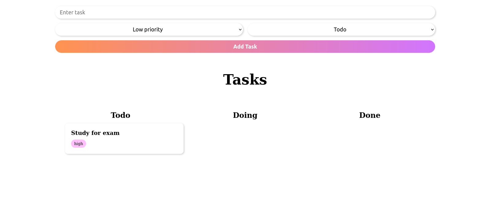

# Task Management Board

## Description

A task management board that allows users to add tasks, set priorities, and mark them as done or not done.

## Setup

- Just download the files and open index.html

## Requirements

- HTML
- CSS
- JavaScript

## Screenshot

## Authors

👤 **Nesrya**

- Github: [@NesryaAbdulkadir](https://github.com/NesryaAbdulkadir)

## 🤝 Contributing

Contributions, issues and feature requests are welcome!

## Show your support

Give a ⭐️ if you like this project!

## Acknowledgments

- Hat tip to anyone whose code was used
- Inspiration
- etc
